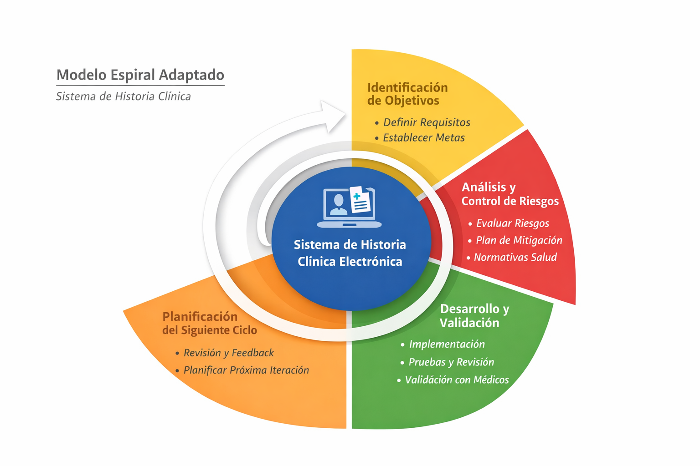

# Diseño y Aplicación de un Modelo de Ciclo de Vida del Software

**Programa:** Ingeniería de Sistemas  
**Asignatura:** Ingeniería De Procesos De Software  
**Autor:** Fabian David Rodriguez Barrera 
**Caso Base:** Sistema de Historia Clínica Electrónica  
---

## 📑 Tabla de Contenidos

1. [Introducción](#-1-Introducción)  
2. [Análisis Comparativo](#-2-Análisis-Comparativo-de-Modelos)  
3. [Selección del Modelo](#-3-selección-y-justificación-del-modelo)  
4. [Diseño Aplicado](#-4-diseño-del-modelo-aplicado)  
5. [Simulación Ejecutiva](#-5-simulación-ejecutiva-del-proyecto)  
6. [Diagrama](#-6-diagrama-del-modelo-aplicado)  
7. [Conclusiones](#-7-conclusiones)  
8. [Referencias](#-8-referencias)
---

##  1. Introducción

El desarrollo de un Sistema de Historia Clínica Electrónica representa un desafío crítico debido a la sensibilidad de los datos médicos, la necesidad de alta disponibilidad y el cumplimiento de normativas del sector salud.

Este trabajo analiza distintos modelos del Ciclo de Vida del Software (SDLC), selecciona el más adecuado y diseña su aplicación estratégica para el caso propuesto.

---

##  2. Análisis Comparativo de Modelos

### 2.1 Modelo en Cascada

Modelo secuencial donde cada fase se completa antes de iniciar la siguiente.

**Ventajas:**
- Alta documentación
- Fácil planificación
- Control estructurado

**Desventajas:**
- Baja flexibilidad
- Alto riesgo ante cambios tardíos

---

### 2.2 Modelo en V

Extensión del modelo cascada que enfatiza validación y verificación en cada fase.

**Ventajas:**
- Alta trazabilidad
- Control de calidad riguroso
- Ideal para sistemas críticos

**Desventajas:**
- Poco adaptable
- Costoso en cambios tardíos

---

### 2.3 Modelo Espiral

Modelo iterativo enfocado en la gestión de riesgos.

**Ventajas:**
- Excelente control de riesgos
- Evaluación continua
- Alta adaptabilidad

**Desventajas:**
- Complejo de gestionar
- Mayor costo

---

### 2.4 Scrum

Metodología ágil basada en iteraciones cortas llamadas sprints.

**Ventajas:**
- Alta flexibilidad
- Entregas incrementales
- Fuerte participación del usuario

**Desventajas:**
- Menor formalidad documental
- Puede ser insuficiente en entornos regulados

---

##  2.5 Matriz Comparativa

| Criterio | Cascada | Modelo V | Espiral | Scrum |
|----------|----------|----------|----------|--------|
| Flexibilidad | Baja | Baja | Alta | Muy Alta |
| Gestión de riesgos | Baja | Media | Muy Alta | Media |
| Documentación | Alta | Muy Alta | Alta | Media |
| Participación usuario | Baja | Media | Alta | Muy Alta |
| Time-to-market | Lento | Lento | Medio | Rápido |
| Complejidad | Baja | Media | Alta | Media |
---

##  3. Selección y Justificación del Modelo

### Modelo Seleccionado: Modelo Espiral

El Modelo Espiral se considera el más adecuado para el desarrollo de un Sistema de Historia Clínica Electrónica debido a su enfoque sistemático en la identificación, análisis y mitigación de riesgos en cada iteración del proyecto.

### Justificación Técnica

Un sistema de historia clínica electrónica presenta:

- Alta criticidad operativa.
- Manejo de información sensible y confidencial.
- Riesgos legales y regulatorios.
- Necesidad de validación constante con profesionales de la salud.
- Posibles cambios normativos durante el desarrollo.

El Modelo Espiral permite evaluar riesgos técnicos, de seguridad, financieros y legales en cada ciclo, reduciendo la probabilidad de fallos críticos.

### Justificación Estratégica

Considerando el contexto organizacional:

- Equipo de desarrollo mediano.
- Presupuesto controlado pero flexible.
- Alta necesidad de calidad y confiabilidad.
- Entorno regulado (sector salud).

El modelo seleccionado proporciona un equilibrio entre planificación estructurada y flexibilidad iterativa, asegurando control y adaptabilidad.

---

## 4. Diseño del Modelo Aplicado

### 4.1 Contexto del Proyecto

El proyecto consiste en el desarrollo de un Sistema de Historia Clínica Electrónica para una clínica privada en Colombia, con el objetivo de reemplazar procesos manuales y garantizar trazabilidad, seguridad y disponibilidad de la información médica.

El sistema debe:

- Cumplir normativas nacionales de protección de datos.
- Garantizar confidencialidad, integridad y disponibilidad.
- Permitir acceso controlado por roles (médicos, enfermería, administración).
- Operar 24/7.
---

##  4.2 Fases del Modelo Espiral Aplicado

Cada ciclo de la espiral incluirá:

1. Identificación de objetivos.
2. Análisis y evaluación de riesgos.
3. Desarrollo y validación.
4. Planificación del siguiente ciclo.

### Iteración 1:
- Análisis de requisitos y riesgos legales.
- Prototipo básico del sistema.
- Validación con personal médico.

### Iteración 2:
- Desarrollo del módulo de gestión de pacientes.
- Implementación de control de acceso por roles.
- Pruebas de seguridad iniciales.

### Iteración 3:
- Integración de historial clínico completo.
- Implementación de respaldo automático.
- Pruebas de carga y disponibilidad.

---

## 👥 4.3 Roles y Responsabilidades

- **Gerente del Proyecto:** planificación y seguimiento.
- **Analista de Requisitos:** levantamiento y documentación.
- **Arquitecto de Software:** diseño estructural y seguridad.
- **Desarrolladores:** implementación del sistema.
- **Especialista en Seguridad:** evaluación de vulnerabilidades.
- **Equipo Médico:** validación funcional.

---

## 📄 4.4 Entregables por Iteración

- Documento de requisitos actualizados.
- Informe de análisis de riesgos.
- Prototipo funcional.
- Reporte de pruebas.
- Plan de mejora para siguiente iteración.

---

## 📊 4.5 Métricas de Seguimiento

- Número de defectos por iteración.
- Tiempo promedio de corrección.
- Cumplimiento de objetivos del ciclo.
- Nivel de satisfacción del usuario.
- Disponibilidad del sistema (% uptime).

---

## ⚠️ 4.6 Gestión de Riesgos

**Riesgos principales:**

- Fuga de información médica.
- Fallas en disponibilidad del sistema.
- Cambios regulatorios.
- Resistencia al cambio del personal.

**Estrategias de mitigación:**

- Cifrado de datos.
- Pruebas de penetración.
- Plan de respaldo diario.
- Capacitaciones al personal.

---

##  4.7 Estrategia de Mantenimiento

Se implementará mantenimiento evolutivo e incremental, incorporando mejoras funcionales y actualizaciones de seguridad en nuevos ciclos de la espiral.

---

##  5. Simulación Ejecutiva del Proyecto

### 5.1 Roadmap del Proyecto

El proyecto se desarrollará en ciclos iterativos bajo el Modelo Espiral durante un periodo estimado de 6 meses.

**Fase 1 (Mes 1):**
- Levantamiento de requisitos.
- Identificación de riesgos legales y técnicos.
- Prototipo inicial.

**Fase 2 (Mes 2-3):**
- Desarrollo del módulo de gestión de pacientes.
- Implementación de autenticación segura.
- Pruebas funcionales iniciales.

**Fase 3 (Mes 4-5):**
- Integración completa del historial clínico.
- Implementación de cifrado y respaldo automático.
- Pruebas de seguridad y carga.

**Fase 4 (Mes 6):**
- Validación final.
- Capacitación al personal.
- Despliegue y monitoreo inicial.

---

### ⏱ 5.2 Estimación de Alto Nivel

- **Duración total:** 6 meses.
- **Equipo:** 6 personas.
- **Metodología:** Iteraciones controladas por análisis de riesgos.
- **Enfoque:** Entregas incrementales con validación médica constante.

---

###  5.3 Hitos Principales

- Aprobación de requisitos.
- Prototipo validado por equipo médico.
- Implementación del módulo principal.
- Pruebas de seguridad superadas.
- Sistema desplegado en entorno productivo.

---

###  5.4 Indicadores Clave (KPIs)

- Disponibilidad del sistema ≥ 99%.
- Reducción del uso de papel ≥ 80%.
- Tiempo promedio de acceso a historial < 3 segundos.
- Tasa de defectos críticos < 2% por iteración.
- Nivel de satisfacción del usuario ≥ 85%.

---

###  5.5 Riesgos Estratégicos y Mitigación

**Riesgo:** Incumplimiento normativo.  
Mitigación: Auditorías internas periódicas.

**Riesgo:** Brechas de seguridad.  
Mitigación: Pruebas de penetración y cifrado avanzado.

**Riesgo:** Resistencia al cambio.  
Mitigación: Programa de capacitación y acompañamiento.

---

##  6. Diagrama del Modelo Aplicado

---

##  7. Conclusiones

El Modelo Espiral demostró ser el enfoque más adecuado para el desarrollo de un Sistema de Historia Clínica Electrónica debido a su fuerte orientación a la gestión de riesgos y control de calidad.

En entornos críticos como el sector salud, donde los errores pueden tener impacto legal y humano significativo, la evaluación iterativa y la mitigación temprana de riesgos permiten reducir incertidumbre y aumentar la confiabilidad del sistema.

La aplicación estratégica del modelo garantiza trazabilidad, seguridad y mejora continua, alineándose con las necesidades operativas y regulatorias de una clínica privada en Colombia.

---

## 8. Referencias

- Pressman, R. (2014). Ingeniería de Software: Un enfoque práctico.
- Sommerville, I. (2016). Software Engineering.
- IEEE Std 1074 – Standard for Developing Software Life Cycle Processes.
- Ministerio de Salud y Protección Social de Colombia – Lineamientos de Historia Clínica Electrónica.
- ISO/IEC 27001 – Sistemas de Gestión de Seguridad de la Información.

